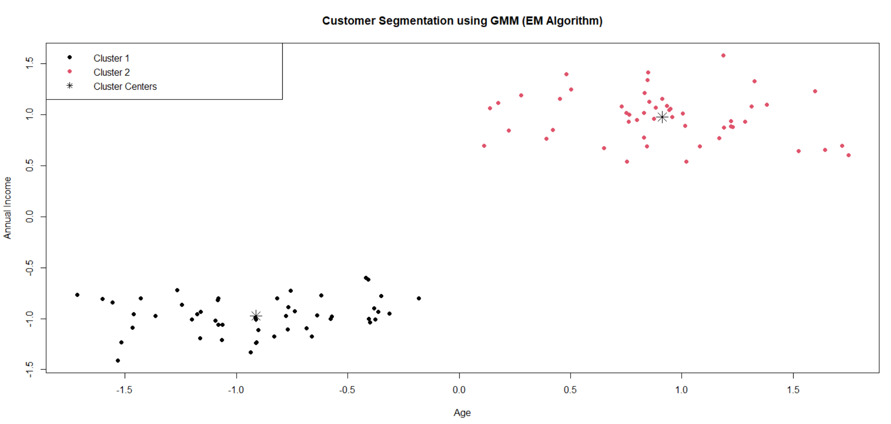
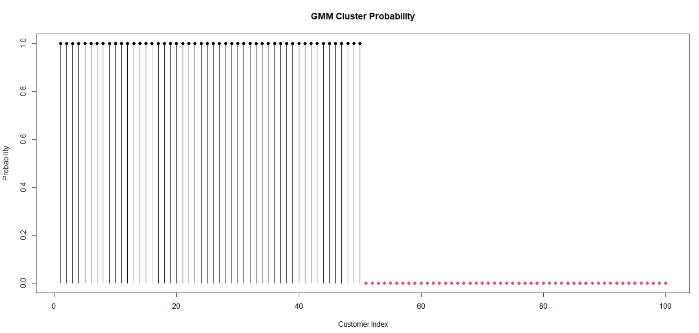

# Customer Segmentation using GMM (EM Algorithm) in R

## Project Overview

This project implements **Customer Segmentation using Gaussian Mixture Model (GMM)** with the **Expectation-Maximization (EM) Algorithm** from scratch using R programming.

The project groups customers based on **Age** and **Annual Income** using an unsupervised machine learning approach.

## Features

- Generates customer data using Age and Income attributes.
- Applies data scaling for better clustering.
- Implements GMM using EM Algorithm without external libraries.
- Performs:
  - Expectation Step (E-Step)
  - Maximization Step (M-Step)
- Calculates multivariate Gaussian probability.
- Computes log-likelihood for convergence.
- Assigns customers into different clusters.
- Visualizes customer segments and cluster probabilities.

## Algorithm Steps

### 1. Data Generation

- Creates two customer groups:
  - Cluster 1:
    - Age mean: 25
    - Income mean: 30,000
  - Cluster 2:
    - Age mean: 45
    - Income mean: 70,000
- Combines both datasets for clustering.

### 2. Parameter Initialization

- Initializes:
  - Mixture weights
  - Mean vectors
  - Covariance matrices
- Random data points are selected as initial cluster centers.

### 3. Expectation Step (E-Step)

- Calculates the probability of each customer belonging to each cluster.
- Computes responsibility values (γ).

### 4. Maximization Step (M-Step)

- Updates:
  - Cluster weights
  - Mean values
  - Covariance matrices

### 5. Log-Likelihood

- Calculates model performance after each iteration.
- Stops when the model reaches convergence.

### 6. Cluster Assignment

- Assigns customers to the cluster with the highest probability.

## Technologies Used

- R Programming
- Base R Functions
- Machine Learning Concepts
- Statistical Computing

## Project Structure

Customer-Segmentation-GMM
│
├── GMM_Project.R
│
├── README.md
│
└── Output
    │
    ├── Customer_Segmentation_Plot.png
    │
    └── Cluster_Probability_Plot.png

## How to Run

- Install R or RStudio.
- Clone the repository.

git clone https://github.com/Madhumidha4310/R-Programming.git

- Open `gmm_em_algorithm.R`.
- Run the complete script.

## Output

The program displays:

- Iteration number
- Log-likelihood values
- Final mixture weights
- Cluster means
- Covariance matrices
- Customer cluster assignments

## Learning Objectives

This project helps to understand:

- Gaussian Mixture Models (GMM)
- Expectation-Maximization Algorithm
- Unsupervised Learning
- Probability Distribution
- Maximum Likelihood Estimation
- Clustering Techniques

## Advantages

- Implements GMM from scratch.
- No external packages required.
- Provides better understanding of EM algorithm.
- Demonstrates real-world customer segmentation.

## Future Improvements

- Support multiple clusters.
- Use real-world customer datasets.
- Add BIC/AIC model selection.
- Compare results with existing GMM libraries.
- Improve visualization using advanced plotting tools.

## Visualization

The project generates:

- Customer segmentation scatter plot.
- Cluster centers visualization.
- Cluster probability plot.

## Visualization Output

### 1. Customer Segmentation Plot

This plot shows the customer clusters generated using GMM.

- Different colors represent different customer groups.
- Black stars represent cluster centers.

### 2. GMM Cluster Probability Plot

This plot shows the probability of each customer belonging to a cluster.

- Higher probability indicates stronger cluster membership.
- Helps understand the confidence of cluster assignment.

